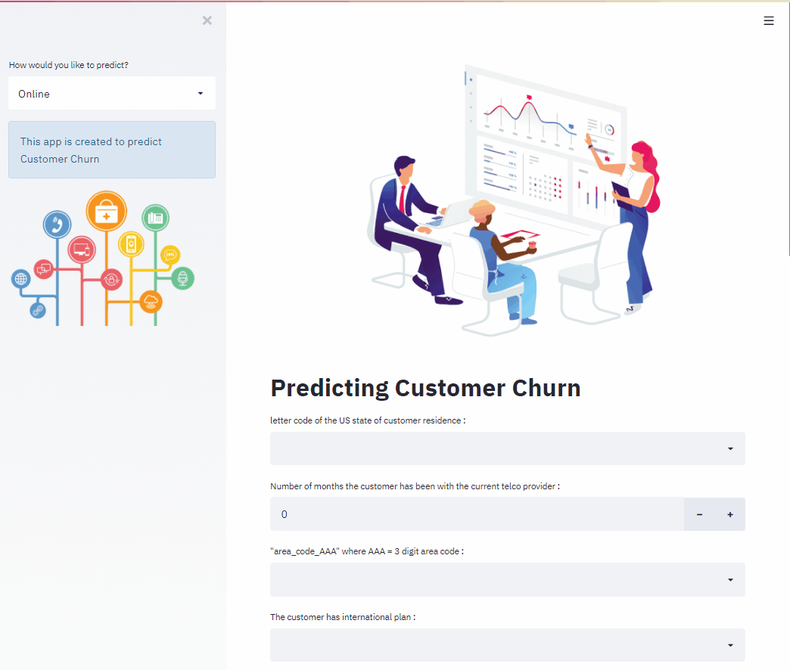

# Churn prediction web app

#### Machine learning based customer churn prediction model, created with _'pycaret'_ and deployed using _streamlit_

---
To use the app, follow these steps:

1. Clone the repository and install the requirements:

`git clone https://github.com/amine-akrout/churn-prediction-web-app.git`

` pip install -r requirements.txt`

2. Run the app 

` streamlit run app.py`

http://localhost:8501/

---

## Demo

